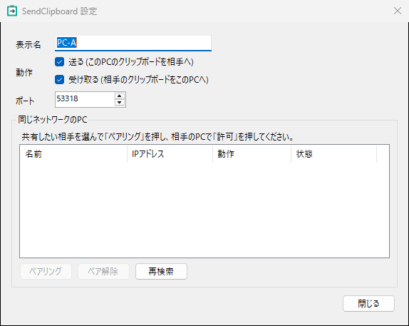

# SendClipboard

同じローカルネットワーク内のPC間でクリップボードを転送するタスクトレイ常駐アプリ (Windows / .NET 10)。  
[PowerToys Mouse Without Borders](https://learn.microsoft.com/windows/powertoys/mouse-without-borders) のクリップボード共有を参考に、クリップボード転送だけを独立させたものです。  
LAN 内の探索とペアリングは [LocalSend](https://github.com/localsend/localsend) の方式を参考にしています。

テキストデータだけを転送します。

## 使い方
1. 共有したいPCすべてで `SendClipboard.exe` を起動する (初回は設定画面が開く)
2. 「動作」で「送る」「受け取る」を選択
3. 「同じネットワークのPC」に一覧が出るので、共有したい相手を選んで「ペアリング」
4. 相手のPCに確認コード付きの許可ダイアログが出る。両方の画面のコードが同じなら「許可」
5. 以後、ペア済みで「受け取る」が有効な相手へ、コピーした内容が自動で送られる

| PC-A | PC-B | 結果 |
|---|---|---|
| 送る | 受け取る | A → B の一方向 |
| 送る+受け取る | 送る+受け取る | 双方向 |

トレイメニューの「通知を表示」で、送受信成功のバルーン通知を切り替えられます。  
エラーは常に通知されます。エラーの詳細はログを参照。

ファイアウォールで、設定したポート (既定 53318) の TCP と UDP の受信を許可すること。

## 仕組み
- **探索** (LocalSend 方式): マルチキャスト `239.255.83.67` とサブネットのブロードキャストに端末情報
  (alias / fingerprint / port など) を送る。announce を受けたPCは応答を返すので、起動直後に一覧が埋まる。
  同じサブネット内のPCだけが対象。
- **ペアリング**: 相手を選んで許可すると、以後その2台の間で転送できるようになる。
- **転送**: ペア済みの相手とだけ行う。両PCの時計は合わせておくこと。
- 対応形式: **テキスト**のみ
- ポートは全PCで同じ値にする

## 設定・ログ
実行ファイルと同じフォルダの `config.json`, `log.txt`
(書き込み権限のあるフォルダに置くこと。Program Files などは不可)
(起動オプション `--data-dir <フォルダ>` で変更可。同じPCで複数起動して試すときにも使える)

`config.json` を別ユーザー・別PCへコピーした場合、ペア情報は引き継がれないのでペアリングし直すこと。

